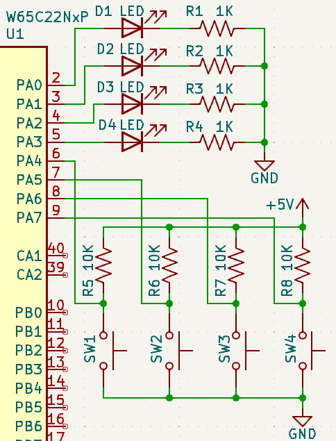

Tali Forth is an excellent platform for playing directly with hardware.  Tali
lets you poke and prod hardware interactively.  Once you figure out how to use the
hardware directly, you can write new words to access the hardware.  These words
can be tested interactively and then be used to write an application that uses the
hardware.

This tutorial shows how to interface some LEDs and pushbutton switches on a Ben
Eater style 65C02 computer with a serial port (recommended for Tali) and the
switches and LEDs wires to PORTA of a 65C22 Versatile Interface Adapter (VIA).
For this example, the VIA will be memory mapped starting at address $6000 and
the LEDs and pushbutton switches will be wired as shown here.  If your hardware
is different, you can adjust the Forth source code accordingly.

=== The Hardware



The LEDs are connected to Port A bits 0-3 and the pushbutton switches are
connected to Port A bits 4-7.  The LEDs are wired such that a "1" in a bit will
light up that LED, while a "0" will turn off that LED.  The switches are wired
in an "active low" configuration, such that pressing a switch will result in a
"0" on that bit, and releasing the switch will result in a "1" on that bit.
Although that may seem backwards, this is a standard method for wiring up
pushbuttons.  Our software will need to account for the fact that the switches
are active low.

=== The Software

The first step is to initialize Port A of the VIA so that bits 0-3 are outputs
(to the LEDs) and bits 4-7 are inputs (from the switches).  The datasheet for
the W65C22 will be our reference material (available directly from WDC at
https://www.westerndesigncenter.com/wdc/documentation/w65c22.pdf).

Referencing Table 2-1 and reading section 2.1 in the W65C22 VIA datasheet shows
that we will need to access the Data Direction Register A (register 3) to set
the direction of the pins as well as Input Register A and Output Register A
(both at register 1 - we'll just name this PA for "Port A" and use that for both
input and output).  To get started, we will make names for these two registers
in the VIA.


```
\ Name the starting address for the VIA.
\ The registers are memory mapped, so register 3 will be
\ 3 higher than the base address.  Change this address if
\ your VIA is in a different location.
$6000 constant via_base_address

\ Name the two registers we will use.
\ Calculate their addresses based on the base address.
via_base_address 1 +  constant PA    \ Port A data
via_base_address 3 +  constant DDRA  \ Port A data direction
```

Now we can make bits 0-3 outputs by writing a value to DDRA (Data Direction
Register A) that has 1s where we want output pins.  We'll use binary values in
this code (starts with % for binary and bit #0 is on the right side) to make it
easy to see the individual bits, but the values can be given in any base that
Forth supports.  We'll also turn on every other LED so it will be easy to see if
our code is working.  Because these registers are 8-bits wide, we will use C!
(Character Store), which stores a single byte at the given address (both given
on the stack).


```
\ Make bits 0-3 on Port A outputs.
%00001111 DDRA C!
\ Turn on every other LED.
%00001010 PA C!
```

That's it!  We are now able to directly control the LEDs from Forth just by
writing a new value to the PA memory location in Forth.  Let's make some helper
words to make working with the LEDs a bit easier.

```
: LED_Init ( -- )  \ Initialize the LED pins as outputs.
   %00001111 DDRA C! ;
: LED! ( c -- )  \ Send byte to LEDs (only bits 0-3 used).
   PA C! ;
```

When the hardware is first powered up, we will need to run LED_Init once (it
won't hurt if it is run again, but it should be run at least once).  After
that, we can just use LED! to send a new pattern to the LEDs.

```
: mydelay ( -- ) \ A simple delay - adjust first number to adjust speed.
   10000 0 do loop ;
: LED_Dance ( -- ) \ Make the LEDs dance
   LED_Init
   10 0 do         \ Loop 10 times
      %1100 LED! mydelay
      %0110 LED! mydelay
      %0011 LED! mydelay
      %1001 LED! mydelay
   loop ;

\ Try it out.
LED_Dance
```

Now that we have control of the LEDs, lets move on to the switches.  These are
wired in an "active low" configuration, so they give a "0" when pressed and a
"1" when not pressed.  We'll start with SW1, which is wired to PA4 so it will be
in bit 4 when we read from Port A.  We will use the C@ (Character Fetch) word to
read an 8-bit value from PA.  Let's use C@ directly first, and then we will make
some helper words for determining if each switch is pressed or not.

```
\ Read the value on Port A and print it out.
PA C@ .
```

`PA` puts the address of Port A on the stack.  `C@` reads the value at that
address and leaves that on the stack.  Finally, `.` prints the value on the
stack.  This will print out the byte value from Port A, however it will contain
both the values of the switches as well as the bits for the LEDs.  By pressing
different switches while running this code, you can see that the value changes.
(Hint: You can press CTRL-P to bring up the previous line of Forth code if you
want to run it again - Tali remembers the last 8 lines.)

We will want to "mask" the bits that we are not interested in - in this case by
forcing them all to be zeroes.  We will use the AND instruction to do that, and
it needs a bitmask (a special value to indicate which bits we want) that has a 1
in the bit location we are interested in and zeroes in all other bits.  For SW1,
on bit 4, that might look like this:

```
PA C@ %00010000 AND .
```

This code is only interested in the switch on bit 4 (SW1).  When that switch is
pressed, bit 4 will be read as a zero (because the switches are active low).
This code zeroes out all of the other bits, so the result of this code will be
zero when the switch is pressed.  Do note that you don't get "1" as the result
when the switch is not pressed, but rather 16 (assuming Tali is in decimal
mode).  That's because bit 4 has the decimal value of 16.  The value for any bit
can be determined by raising 2 to the bit number.

To check a different switch, just change the bitmask.

```
\ Check SW2 on bit 5.
PA C@  %00100000 AND  .
```

This code will print the current status of switch SW2 on bit 5.  It also prints
0 when the switch is pressed, but this prints 64 when the switch is released
because bit 5's value is twice that of bit 4.

What we want are some helper words for each button to tell if they are pressed
or not.  We can then use whether they are pressed or not as a true/false value
to control loops and IF statements.  Words that test for something and return a
true or false value usually end with a question mark in the name.


```
: SW1?  ( -- f ) \ Return TRUE if SW1 is pressed.
   PA C@  %00010000 AND  0= ;
```

Note that we are not printing the result here, but we are checking to see if it
is zero or not and leaving the true or false result from `0=` on the stack for
other code to use.  Our stack comment indicates that this word leaves a flag on
the stack after it is run.  Other words could be created for the other buttons by
changing the bitmask.

Finally, let's put this all together and have the LEDs dance until the SW1
switch is pressed.  Note that you may need to hold the button down for a bit, as
it's only checked at one point during the LED dance.

```
: LED_Dance2 ( -- ) \ Dance the LEDs until SW1 pressed.
   LED_Init
   BEGIN
      %1100 LED! mydelay
      %0110 LED! mydelay
      %0011 LED! mydelay
      %1001 LED! mydelay
   SW1? UNTIL ;

\ Try it out.
LED_Dance2
```

=== LCD Example

With the above under our belt, we're ready to tackle something a bit more
advanced.  We'll replace the LEDs and buttons with a character LCD screen.

This section shows how to interface with an LCD on a Ben Eater style 65C02
computer with a serial port (recommended for Tali) and LCD wired to PORTA and PORTB of a
65C22 as shown here: https://eater.net/schematics/6502.png

TODO: Redraw schematic to show LCD wiring

The important details are that the 65C22 Versatile Interface Adapter (called the
VIA from here on) is memory mapped starting at address $6000, the LCD DB0-7
(Data Bus) pins are connected to VIA pins PB0-7 (Port B), LCD RS (register select) is
connected to VIA PA5, LCD R/W* (read/write*) is connected to VIA PA6, and LCD E
(enable) is connected to VIA PA7.  The remaining Port A pins can be used for
other purposes, and we will be careful not to disturb those pins as we adjust
RS, R/W*, and E.

The reference materials to consult will be the W65C22 datasheet for the VIA and
the Hitachi HD44780U datasheet (your character LCD likely either has this
chipset or a clone of it - search for "ADE-207-272(Z)" to locate the exact
version used here).

Because the LCD is connected to the VIA, we will need to initialize the VIA
first, and then the LCD.  We need bits all 8 bits of Port B on the VIA, as well
as bits 5-7 on Port A to be outputs.  Reading in the W65C22 VIA datasheet shows
that we will need to access Data Direction Register A (register 3) and Data
Direction Register B (register 2) to set the direction of the pins. Then can use
Output Register A (register 1) and Output Register B (register 0) to send the
data and commands to the LCD. To get started, we will make names for these
registers in the VIA.

```
\ Name the starting address for the VIA.
\ The registers are memory mapped, so register 2 will be
\ 2 higher than the base address.  Change this address if
\ your VIA is in a different location.
$6000 constant via_base_address

\ Name the two registers we will use.
\ Calculate their addresses based on the base address.
via_base_address     constant PB    \ Port B data
via_base_address 1 + constant PA    \ Port A data
via_base_address 2 + constant DDRB  \ Port B data direction
via_base_address 3 + constant DDRA  \ Port A data direction
```

Now we can initialize the LCD.  This will be more involved than just making the
correct pins on the VIA outputs.  We'll do that first, but then we will need to
talk to the HD44780U IC on the LCD screen.  The HD44780U datasheet, in the
"Interfacing the HD44790U" section, shows how to talk to this IC.  You place the
data you want to send to the LCD (either an instruction or a character to
display) on the data lines (which will be Port B), use RS to select if this is a
command (RS=0) or a character to display (RS=1), use R/W* to select if you a
reading (1) or writing (0), and finally you strobe the E line by bringing it
high and then back low.  It's this action that actually transfers the data or
command into the LCD.

Because we're going to need to twiddle the control lines, it makes sense to create
words for doing that.  These words need to adjust just a single bit, such as RS,
without changing any of the other bits.  Accidentally bringing E high, for
example, might strobe in a command when we weren't ready for that yet.  To
accomplish this, we will read in the current value on Port A, use a bitmask to
turn on or off an individual bit, and then write the new value back to Port A,
thus updating just a single bit.  This is commonly called the
"read-modify-write" technique.

```
: LCD_RS_HIGH ( -- )  \ Make the LCD RS line high.
   PA C@        \ Get the current value of Port A.
   %00100000 OR \ Make the RS bit high.
   PA C!        \ Write it back to Port A.
;

: LCD_RS_LOW ( -- ) \ Make the LCD RS line low.
   PA C@         \ Get the current value of Port A.
   %11011111 AND \ Make the RS bit low.
   PA C!         \ Write it back to Port A.
;
```

Here you can see we use the OR instruction combined with a bitmask that has a
"1" in the desired location to turn on a particular bit, and we use the AND
instruction combined with a bitmask that has a "0" in the desired location to
turn off a particular bit.  We'll do the same for the R/W* line (note that Forth
allows symbols like / and * in the name of a word).

```
: LCD_R/W*_HIGH ( -- )  \ Make the LCD R/W* line high.
   PA C@        \ Get the current value of Port A.
   %01000000 OR \ Make the R/W* bit high.
   PA C!        \ Write it back to Port A.
;

: LCD_R/W*_LOW ( -- ) \ Make the LCD R/W* line low.
   PA C@         \ Get the current value of Port A.
   %10111111 AND \ Make the R/W* bit low.
   PA C!         \ Write it back to Port A.
;
```
We are only going to strobe E, so we won't bother with separate words for high
and low for this line, and will just create a word for strobing data to the LCD.

```
: LCD_Strobe ( -- )  \ Bring E high and then low
   PA C@          \ Get Port A value.
   DUP            \ Make a copy.
   %10000000 OR   \ Make E high.
   PA C!          \ Send it out.
   %01111111 AND  \ Make it low.
   PA C!          \ Send it out.
;
```
We don't need to do any bitmasking for the data, as we're using the entire 8-bit
Port B for the data and we will read or write it all at once.  We will make some
helper words to send commands and to send data, and then we can fully initialize
the LCD.  We are also going to take a shortcut here and not bother to check the
"busy" flag of the LCD, as this would require changing the direction of the data
lines.  The penalty for this shortcut is that we will need to
delay after each command or character to give the LCD time to process it, and we
will have to use the maximum delay (4.1ms) even though most command are
processed in microseconds.

```
: LCD_Delay ( -- ) \ A simple software delay.
  400 0 do loop ; \ About 5ms at 1MHz operation, scale value for higher clocks.
  
: LCD_Command ( u - ) \ Send the given command to the LCD.
   PB C!        \ Put the command on the data lines.
   LCD_RS_LOW   \ RS low to select command mode
   LCD_R/W*_LOW \ R/W* low to select writing to LCD
   LCD_Strobe   \ Hand it over to the LCD.
   LCD_Delay
;

: LCD_PutChar ( u - ) \ Send the given character to the LCD.
   PB C!        \ Put the character on the data lines.
   LCD_RS_HIGH  \ RS high to select character mode
   LCD_R/W*_LOW \ R/W* low to select writing to LCD
   LCD_Strobe   \ Hand it over to the LCD.
   LCD_Delay
;

: LCD_Init ( -- )
   \ Make the correct pins outputs on the VIA.
   %11111111 DDRB C!  \ Data lines all outputs
   \ Make only bits 5-7 outputs on Port A without affecting
   \ the other bits (they may be used for something else).
   DDRA C@  %1110000 OR  DDRA C!
   \ Start sending commands to initialize the LCD.
   %00111000 LCD_Command \ This needs to be sent three times
   %00111000 LCD_Command \ for reliable software reset of
   %00111000 LCD_Command \ the LCD.
   %00001110 LCD_Command \ Turn on display and cursor.
   %00000110 LCD_Command \ Move cursor after each char.
   %00000001 LCD_Command \ Clear the screen.
;  
```

The three main words that will be used in applications are LCD_Init to
initialize the LCD into 4-bit mode, LCD_Command to send commands to the LCD (see
pages 24-25 of the HD44780U datasheet for available commands), and LCD_PutChar to
send text for the LCD to display.  Lets test these by printing a * on the
screen.

```
LCD_Init
42 LCD_PutChar \ 42 is the ASCII value for *
```

If all is well, the LCD screen should have just a * on it, with a cursor in the
next location.  If anything isn't working, we can run the guts of a word
interactively and check the hardware pins to see where it goes wrong.  Once this
is working, we can print "Hi" next.

```
char H LCD_PutChar
char i LCD_PutChar
```

This is fine for very short messages, but it would be nice to be able to print
longer messages.  Next we will make a word that prints an entire string to the
LCD screen.

```
: LCD_type ( addr u -- ) \ Print a string to the LCD
 0 ?do \ Loop through all the characters
   dup i + c@  LCD_PutChar \ Print the current letter
 loop
 ;
```

Now we can print strings so the LCD.  Do note that S" needs a space before the
first letter of the string.

```
s" Hi there" LCD_type
```

We're making a bit of a mess on our LCD, so lets clear the screen.  That's
command 1 (%00000001) in the datasheet.

```
1 LCD_command
```

That seems handy enough we should make it into a word.

```
\ Clear the LCD screen.
: LCD_clear ( -- )   1 LCD_command ;
```

